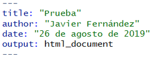
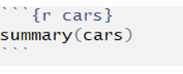
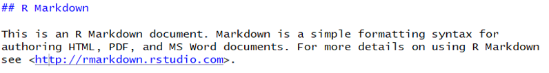
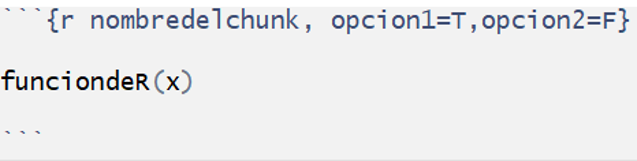

background-image: url(https://bookdown.org/yihui/rmarkdown/images/hex-rmarkdown.png)
background-size: contain

```{r setup, include=FALSE}
options(htmltools.dir.version = FALSE)
knitr::opts_chunk$set(echo = TRUE,message = F,warning = F)
```

---
class: inverse, center, middle

# Empezamos!

---
background-image: url(https://es.r4ds.hadley.nz/diagrams_w_text_as_path/es/data-science.svg)
background-size: 100% 100%

# Proceso Recursivo en Ciencia de Datos

---
# ¿Qué es `Rmarkdown`?


- Es un marco de referencia para la ciencia de datos. En esta podemos combinar códigos, resultados y comentarios
  - Reproducibles
  - Distintos formatos de salida (pdf, word, ppt, etc)

--

- Es decir, un paquete de R que nos va a permitir generar documentos que incorporen cálculos, resultados y funciones realizados en R


---
# ¿Qué es `Rmarkdown`?

[Ejemplo](https://www.unab.cl/ciudhad)

--

[Otro Ejemplo](https://cepr.uai.cl/boletin/son-2021-r5/)

--

[Otro Ejemplo](https://jfernandez.netlify.app/)

--

[Más Ejemplos](https://rmarkdown.rstudio.com/gallery.html)


---
background-image:url(https://bookdown.org/yihui/rmarkdown/images/hex-rmarkdown.png)
background-size: 15% 20%
background-position: center bottom
# ¿De qué nos sirve `Rmarkdown`?
 

--

- Comunicar a los tomadores de decisiones (para la generación de informes/reportes)

--

- Para que otros DS sepan como llegaste a tus resultados (reproductibilidad)

--

- Un entorno en el que puedes agregar no solo lo que hiciste, sino el como lo hiciste y explicaciones.


---
# ¿Cómo utilizar `Rmarkdown`? 

- Dar click en el símbolo (+) que se encuentra en la esquina superior izquierda

--

- Elegir el tipo de documento

--

- Elegir el tipo de formato


--

- Dar click al símbolo knit que se encuentra en la parte superior del “script”.


---
# Estructura de `Rmarkdown`

--

- Encabezado YAML (Yet Another Markup Language)

.left[]

--

- Bloques de código (o chunks) de R rodeado de tres comillas


.left[]

--

- Texto mezclado con texto simple formateado con # Encabezado e _itálicas_

.left[]


---


# Estructura de `Rmarkdown`


- Encabezado YAML (Yet Another Markup Language)

.left[]

--

- Sirve para controlar detalles del output

--

  - title: Título del informe
  - author:  Autor del informe
  - date: Fecha
  - output: Tipo de archivo en el que queremos compilar nuestro informe. Existen múltiples opciones: html_document, pdf_document, word_document, etc

---

# Estructura de `Rmarkdown`


--

- Bloques de código (o chunks) de R rodeado de tres comillas

.left[]


--

  - Existen 3 formas de insertarlos:

    - Ctrl+Alt+I
    - Dar click en la parte superior del visor de script en Insert
    - Escribirlo manualmente

--

  - Tiene una estructura que contiene nombre (opcional) y opciones particulares:

.left[]


---

# Opciones para los Chunks

--

- `echo=FALSE`: Previene que se Imprima en el output la línea de código asociada a la función que - ejecuta
- `eval=FALSE`: Evita que el código sea evaluado (o se ejecute)
- `include=FALSE`: Se ejecuta el código, pero sin mostrar los resultados ni el código en el output
- `message=FALSE` o `warning=FALSE`: Previene que se impriman en el output mensajes(o warnings) - asociados a la línea de código que ejecuta
- `error=TRUE`: Se renderiza (o compila) aunque el código devuelva un error

--

Existen más de 60 opciones que puedes revisar [Aquí](https://yihui.org/knitr/options/)

---
# Estructura de `Rmarkdown`

--

- Texto mezclado con texto simple formateado con # Encabezado e \_itálicas\_

--

.left[]

--

  - Lo que esté fuera del YAML y de los chunks es texto que será mostrado en nuestro output. Las reglas de formato básicas son las siguientes:

    - Encabezado o títulos y subtítulos:  ###, ## , #
    - \*cursiva\* ,\*\*negrita\*\* , subindice ~2~ y supraindice^2^
    - Enlaces web: \[texto a elección\]<www.udp.cl>
    - Imágenes: \(path/de/la/imagen.jpg\)

---

# Rpubs

--

- Es una plataforma que nos permite publicar nuestros trabajos e informes en Rmarkdown.


--

- Para utilizarlo debemos:
  - Crear una cuenta en http://rpubs.com/users/new
  - Vincular tu cuenta en Rstudio, haciendo click en el boton en la esquina superior derecha del note script y seleccionar manage accounts.


---
class: inverse, middle, center

# Muchas gracias!

---

# Laboratorio

- Revisaremos brevemente las principales características, usos y opciones de esta poderosa herramienta

--

- El objetivo es poner en práctica lo que aquí aprendimos

--

- A trabajar!

--
.center[]
