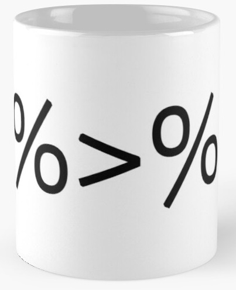
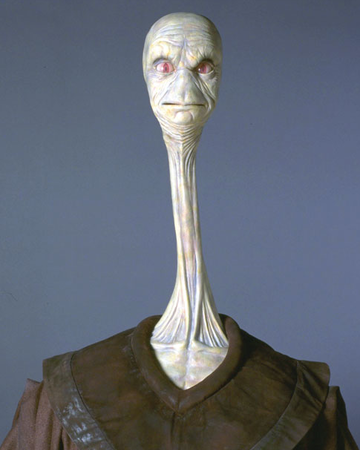

background-image: url(https://cidetic.unlu.edu.ar/wordpress/wp-content/uploads/2018/08/Rlogo.png)

```{r setup, include=FALSE}
options(htmltools.dir.version = FALSE)
knitr::opts_chunk$set(echo = TRUE,message = F,warning = F)
```

---

# Hoy veremos...

- Motivación
- Data Wrangling en R:
  - `dplyr`
  - `data.table`
  - `dtdplyr`
- Aplicación con datos "reales"

---
class: inverse, center, middle

# Empezamos!

---
background-image: url(https://es.r4ds.hadley.nz/diagrams_w_text_as_path/es/data-science.svg)
background-size: 100% 100%

# Proceso Recursivo en Ciencia de Datos

---
# Data Wrangling?

- Es el proceso de seleccionar, limpiar, unificar y consolidar los datos que se usaran para determinado análisis
--

- En esta tarea se invierta entre un 50% y 80%<sup>1</sup> del tiempo de desarrollo de un proyecto de datos

.footnote[
[1] Ver en [Principles of Data Wrangling](https://www.bankingtech.com/files/2017/10/Trifacta_Principles-of-Data-Wrangling.pdf)]

---
# Data Wrangling en R

- Actualmente en R existen tres "sets" de herramientas para realizar trabajo con datos:
  - `base`
  - `dplyr`
  - `data.table`
--

- ¿Por qué aprender los dos y no solamente quedar con el **mejor**?


---
class: inverse, center, middle

# Como se cree que es

---
background-image:url(imagenes/vd.png)
background-size: contain

---
class: inverse, center, middle

# Como es realmente

---
background-image:url(imagenes/vd2.png)
background-size: contain

.footnote[
Basado en exposición de [Hadley Wickham](https://www.youtube.com/watch?v=vYwXMnC03I4&ab_channel=MangoSolutions)]
---
background-image:url(imagenes/dplyr.png)
background-size: 15% 20%
background-position: center bottom
# `dplyr` y la gramática de los datos 

--

- Forma parte del set de herramientas de tydiverse 

--

- Se destaca por su **readability**

--

- Es uno de los paquetes más utilizados por los usuarios R
- Es el paquete más utilizado para manipular datos por los usuarios de R

---
background-image:url(imagenes/dplyr.png)
background-size: 15% 20%
background-position: center bottom
# `dplyr` y la gramática de los datos 

Se estructura en base a un conjunto de cinco verbos:

- `mutate()`: Agrega una nueva variable que es función de otra existente

--

- `select()`: Selecciona variables basado en sus nombres


--

- `filter()`: Selecciona observaciones basadas en su valor

--


- `summarise()`: Reduce múltiples valores a un solo resumen dada una función

--

- `arrange()`: Ordena la base de datos

--

Además, se puede combinar con `group_by()` que nos permite realizar operaciones por grupo.


---
# `magrittR` y la revolución de los pipes

.left[]

--

.right[]

--

.upimage[]

---
background-image:url(imagenes/magrittr.jpg)
background-size: 30% 30%
background-position: center bottom

# `magrittR`

Usualmente en R las funciones se escriben al igual que en las matemáticas:

`f(x)`

--

Eso significa que estoy aplicando la función `f()` al argumento `x`. Los pipes nos permiten escribir esto de la siguiente manera:

`x %>% f()` 

--

Esto en un principio pareciera no tener mucha utilidad, pero en el caso de funciones complejas con múltiples argumentos es más fácil entender

`x %>% f(y,z) %>% g(a,b) %>% h(e)`

--

que

`h(g(f(x,y,z),a,b),e)`

--

.bottomright[]

---
class: inverse, center, middle

# Un pequeño ejemplo

---
# Datos


Usaremos los siguientes datos para los ejemplos a continuación:

--

```{r eval=require('DT'), tidy=FALSE}
library(dplyr)
DT::datatable(
  head(starwars[,1:5], 10),
  fillContainer = FALSE, options = list(pageLength = 5)
)
```

---


.left-column[
### `select()`
]

.right-column[
```{r}
starwars<-starwars %>% 
  select(name,height,sex,species)
starwars
```
]

---
.left-column[
### `select()`
### `mutate()`
]

.right-column[
```{r}
starwars %>% 
  mutate(hmts=height/100)
```
]

---
.left-column[
### `select()`
### `mutate()`
### `filter()`
]

.right-column[
```{r}
starwars %>% 
  filter(species=="Human")
```
]

---

.left-column[
### `select()`
### `mutate()`
### `filter()`
### `arrange()`
]

.right-column[

```{r }
starwars %>% 
  arrange(desc(height)) #<<
```

]

--


.bottomright[]

---

.left-column[
### `select()`
### `mutate()`
### `filter()`
### `arrange()`
### `summarise()`
]

.right-column[
```{r}
starwars %>% 
  summarise(mean(height)) #<<
```

]

--

.right-column[
```{r}
starwars %>% 
  summarise(mean(height,na.rm = TRUE)) #<<
```

]


---
.left-column[
### `select()`
### `mutate()`
### `filter()`
### `arrange()`
### `summarise()`
### + `group_by()`
]

.right-column[
```{r}
starwars %>%
  group_by(species) %>%
  summarise(mean=mean(height),n=n())
```

]
---

.left-column[
### `select()`
### `mutate()`
### `filter()`
### `arrange()`
### `summarise()`
### + `group_by()`
]

.right-column[
```{r}
starwars %>%
  group_by(species) %>%
  summarise(mean=mean(height,na.rm=T),n=n()) %>%
  arrange(desc(n))
```

]

---
background-image:url(imagenes/DT.png)
background-size: 30% 30%
background-position: center bottom

# `data.table` y la simplicidad de la eficiencia

- No tiene dependencias de otros paquetes fuera de los recursos base.

--

- Se destaca por su **eficiencia**
  - Velocidad de procesamiento (Tiempo)
  - Utilización de memoria

--

- Es uno de los paquetes más utilizados por los usuarios R
- Excelente retrocompatibilidad

---
# `data.table`

Este paquete tiene la siguiente forma general (sintaxis):

--

<br><br>

 .center[.big[`ObjetoDT[   i   ,    j  ,  by]`]]
  
  
<br><br>

--

"Tomamos `ObjetoDT`, seleccionamos/reordenamos las filas `i`, entonces calculamos `j`, agrupados por `by`"
---

class: inverse, center, middle

# El mismo ejemplo, pero ahora DTeable

---


Estas son algunas funciones básicas:

.left-column[
### .little[`data.table()`]  
]

.right-column[

```{r}
library(data.table)
starwars<-as.data.table(starwars)
class(starwars)
```

]

---

Estas son algunas funciones básicas:

.left-column[
### .little[`data.table()`]
### .little[`DT[ ,.(x,y)]`]
]

.right-column[

```{r}
starwars<-starwars[,.(name,height,sex,species)]
starwars
```

]

---

Estas son algunas funciones básicas:

.left-column[
### .little[`data.table()`]
### .little[`DT[ ,.(x,y)]`]
### .little[`DT[ ,y:=f(x)]`]
]

.right-column[
```{r}
starwars[,hmts:=height/100]
starwars
```

]


---

Estas son algunas funciones básicas:

.left-column[
### .little[`data.table()`]
### .little[`DT[ ,.(x,y)]`]
### .little[`DT[ ,y:=f(x)]`]
### .little[`DT[x opr y]`]
]

.right-column[
```{r}
starwars[species=="Human"]
```

]


---

Estas son algunas funciones básicas:

.left-column[
### .little[`data.table()`]
### .little[`DT[ ,.(x,y)]`]
### .little[`DT[ ,y:=f(x)]`]
### .little[`DT[x opr y]`]
### .little[`DT[order(x)]`]
]

.right-column[
```{r}
starwars[order(height,decreasing = TRUE)]
```

]

---

Estas son algunas funciones básicas:

.left-column[
### .little[`data.table()`]
### .little[`DT[ ,.(x,y)]`]
### .little[`DT[ ,y:=f(x)]`]
### .little[`DT[x opr y]`]
### .little[`DT[order(x)]`]
### .little[`DT[,f(x),by=z]`]
]

.right-column[
```{r}
starwars[,.(mean=mean(height,na.rm = T),n=.N),by=species]
```

]


---

Estas son algunas funciones básicas:

.left-column[
### .little[`data.table()`]
### .little[`DT[ ,.(x,y)]`]
### .little[`DT[ ,y:=f(x)]`]
### .little[`DT[x opr y]`]
### .little[`DT[order(x)]`]
### .little[`DT[,f(x),by=z]`]
]

.right-column[
```{r}
starwars[,.(mean=mean(height,na.rm = T),n=.N),by=species][order(n,decreasing = T)]
```

]


---
class: inverse, middle, center

# Reflexiones finales

---

# `data.table` y `dplyr`

- Ambos tienen utilidades y fortalezas

--

- Mientras que `dplyr` aporta una mayor readability y simpleza a la hora de codificar,

--

- es innegable la eficiencia que provee `data.table`. De hecho, en algunos : [benchmarks](https://h2oai.github.io/db-benchmark/), tiene resultados competitivos fuera de R

--

- Si se está comenzando en R, puede que `dplyr` sea más intuitivo

--

- Si se va a trabajar con muchos datos, la alternativa más recomendable sería `data.table`

--

- [`dtplyr`](https://dtplyr.tidyverse.org/)

--
.right[]


---
class: inverse, middle, center

# Muchas gracias!

---

# Laboratorio

- Realizaremos un trabajo de datos aplicado con la base de datos del IVE (interrupción del embarazo) del DEIS 

--

- El objetivo es poner en práctica lo que aquí aprendimos

--

- A trabajar!

--
.center[]
